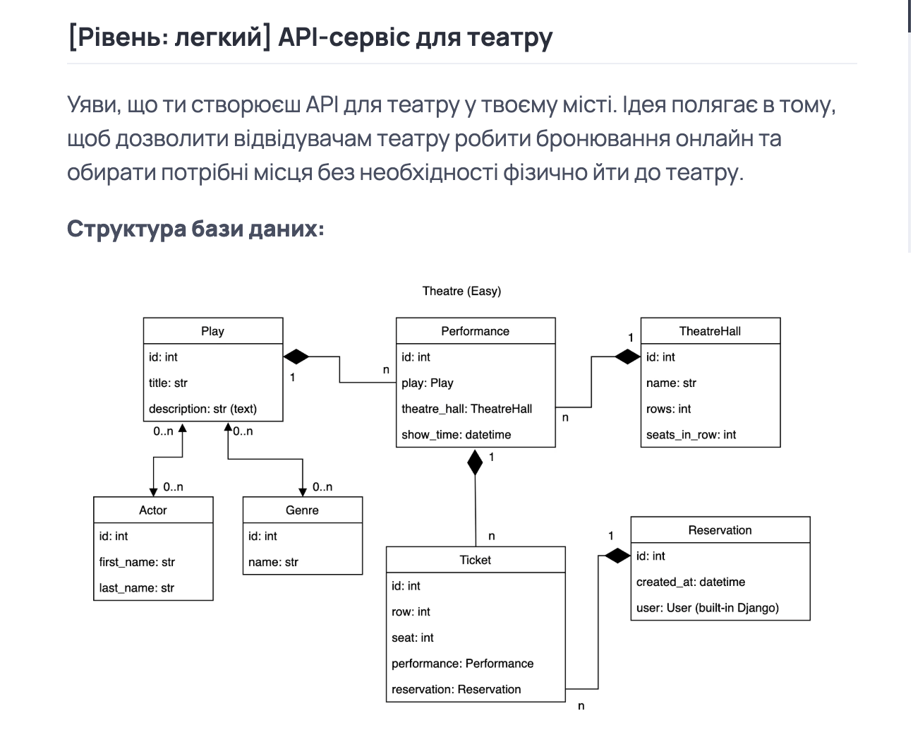

# 🎭 Theater API Service

A RESTful API that allows theater visitors to:
- View available plays and performances
- Choose halls and showtimes
- Book tickets online without visiting the theater physically

Built with **Django** and **Django REST Framework**.

---

## 🧱 Database Structure



- **Play** – A theater play with a title, description, genres, and actors
- **Performance** – A scheduled show of a specific play in a specific hall
- **TheatreHall** – A hall with defined number of rows and seats per row
- **Ticket** – Represents a specific seat at a performance, linked to a reservation
- **Reservation** – A user's booking containing multiple tickets
- **User** – Standard Django User model

---

## 🔧 Tech Stack

- Python 3.11+
- Django 5.x
- Django REST Framework
- PostgreSQL
- JWT Authentication
- Docker / Docker Compose

---

## 🚀 Getting Started Locally

```bash
# Clone the repo
git clone https://github.com/dimakherson74/theater-ticket-service.git
cd theatre-api

# Create and activate virtual environment
python -m venv venv
source venv/bin/activate

# Install dependencies
pip install -r requirements.txt

# Apply migrations
python manage.py migrate

# Run development server
python manage.py runserver
```

## RUN WITH DOCKER
Docker should be installed

- docker-compose build
- docker-compose up

## Getting access

 - create user via /api/user/register/
 - get asses token /api/user/token/

## 🎭 Theatre Booking API — Features

- 🔐 Authentication & Authorization
User registration and login (JWT token-based authentication)

- 🎟️ Ticket Booking System
Book tickets for a selected performance
View ticket details for specific reservations

- 📅 Performance Management
List all upcoming performances
View performance details (play, hall, show time)

- 🎭 Play & Genre
Assign one or more Genres to a play
Assign Actors to a play

- 🧑‍🎤 Actor Management
Add and manage actor information

- 📥 Reservations
Create reservations
View user’s past and upcoming reservations
Timestamp for when the reservation was made
